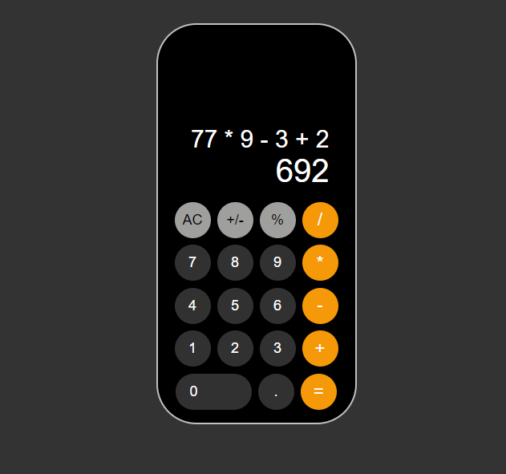

# Simple Calculator App

The Calculator App is a simple yet functional calculator built with React and TypeScript. It supports basic arithmetic operations, percentage calculations, and toggling between positive and negative numbers.




## Features

- Basic Arithmetic Operations: Addition, subtraction, multiplication, and division.
- Percentage Calculation: Converts numbers to their percentage values.
- Sign Toggle: Switch between positive and negative numbers.
- Responsive Design: Works well on both desktop and mobile devices.


## Tech Stack

- React: JavaScript library for building user interfaces.
- TypeScript: Typed superset of JavaScript.
- SCSS: Preprocessor for CSS to write more maintainable styles.
- ESLint & Prettier: Tools for code linting and formatting.


## Getting Started

- Clone the repository
- Install dependencies: npm install
- Start the development server: npm run dev
- Open http://localhost:3000 in your browser.
## Usage

### Basic Calculations:

- Click on numbers and operators to perform calculations.
- Use the = button to see the result.

### Percentage:

- Enter a number and click the % button to convert it to a percentage.

### Toggle Sign:

- Click the +/- button to switch between positive and negative values.

```
calculator
├─ .gitignore
├─ eslint.config.js
├─ index.html
├─ package-lock.json
├─ package.json
├─ public
├─ README.md
├─ src
│  ├─ App.scss
│  ├─ App.tsx
│  ├─ assets
│  │  └─ react.svg
│  ├─ components
│  │  ├─ Button.tsx
│  │  └─ Calculator.tsx
│  ├─ main.tsx
│  ├─ utils
│  │  └─ buttonConfig.ts
│  └─ vite-env.d.ts
├─ tsconfig.app.json
├─ tsconfig.json
├─ tsconfig.node.json
└─ vite.config.ts

```